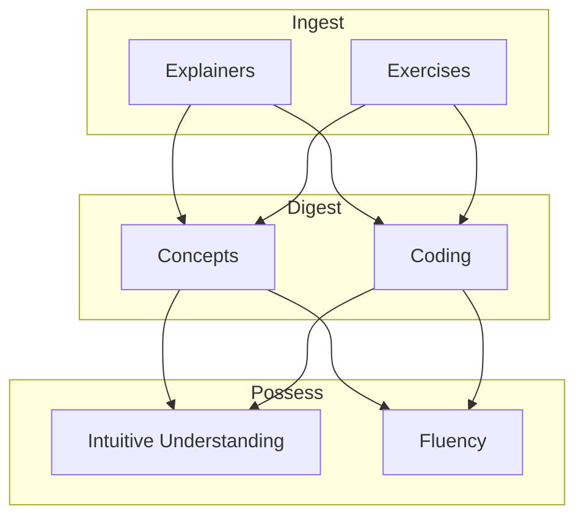

# AI/Learning Model Draft

This idea is a map of several concepts while i figure out self-learning AI/ML stuff in school and at work.

## Stages

### Ingest

* **Explainers**: Forms of content to be consumed (e.g., YouTube videos like those by 3Blue1Brown).
* **Exercises**: Assignments, exams, or practice tasks.

### Digest

* **Concepts**: Specific ideas to be acquired.
* **Coding**: Ability to write code or instruct AI to generate the right code.

### Possess

* **Intuitive Understanding**: Internal, invisible, hard to measure form of "knowing".
* **Fluency**: Performative form of "knowing".

## Relationship Map

