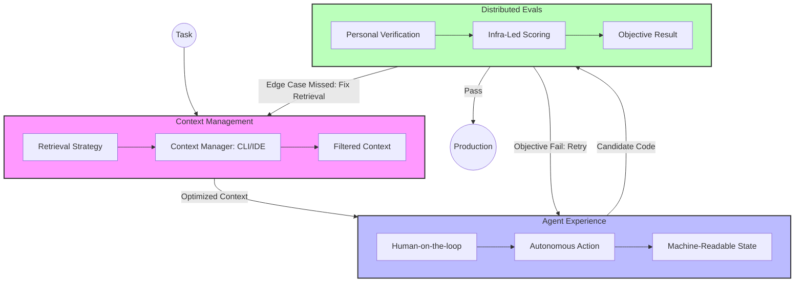

---
categories:
- AI Engineering
description: A blueprint for the modern AI engineering stack, connecting Context Management, Agent Experience (AX), and Distributed Evals.
tags:
- AI Engineering
- Architecture
- Workflow
- AX
title: "The AI-Native Developer Stack: A Unified Framework"
---

# The AI-Native Developer Stack: A Unified Framework

Building production-grade AI applications is no longer about "prompting" a model. It’s about building a system that orchestrates **Context**, manages **Agents**, and distributes **Verification**.

These three pillars—**Context Engineering**, **Agent Experience (AX)**, and **Developer-Led Evals**—form the backbone of the "AI Engineer" meta.

## The Pillars of the Stack

1. **Context Engineering:** The art of preparing the model's "working memory." This isn't just about feeding files; it's about mastering **Retrieval** (lexical vs. semantic) and using tools like **Gemini CLI** or **Claude Code** as dedicated context managers.
2. **Agent Experience (AX):** Shifting from "Human-in-the-loop" to **"Human-on-the-loop."** We stop building for human readability and start building machine-readable states and tool-centric interfaces that agents can navigate autonomously.
3. **Developer-Led Evals:** Filling the **"Missing Middle"** between subjective vibe checks and over-engineered enterprise testing. It's about empowering individual devs to spin up custom verification loops using shared company infrastructure.

## The Synergy Map

## The Workflow in Action

The "AI-Native" workflow is a continuous conversation between these three layers:
- **Context Management** prepares the environment by fetching only the most relevant signal.
- **The Agent** executes the task, prioritizing **Agent Experience (AX)**—using reliable tool calls and persistent loops rather than constant human hand-holding.
- **Distributed Evals** acts as the objective gatekeeper. Because devs can build their own evals fast, the feedback loop stays tight. If a test fails, the system knows exactly whether it needs more context or a different agent strategy.

## Conclusion

The future of software isn't about writing code; it's about engineering the environment in which code is written. By mastering these three pillars, you move from being a user of AI to an orchestrator of AI-native systems.
